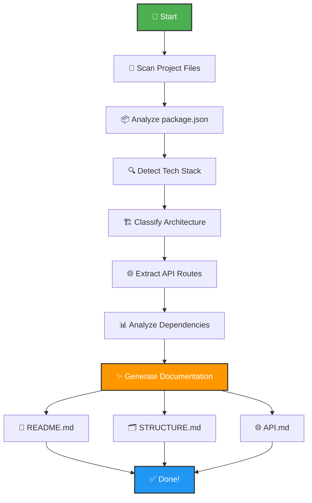

<div align="center">

<br />

<h1>
  📚 repo-docgen
</h1>

<h3>🚀 AI-Powered Documentation Generator for Modern Developers</h3>

<p><strong>Transform your codebase into stunning, professional documentation in seconds with zero configuration</strong></p>

<br />


<br />

**[🚀 Quick Start](#-quick-start)** • 
**[✨ Features](#-features)** • 
**[📖 Demo](#-see-it-in-action)** • 
**[🎯 Use Cases](#-use-cases)** • 
**[⚙️ CLI Options](#️-cli-options)** • 
**[🤝 Contributing](#-contributing)**

<br />

</div>

---

## 🎯 What is repo-docgen?

**repo-docgen** is an **intelligent, zero-configuration CLI tool** that automatically analyzes your entire codebase and generates **beautiful, comprehensive, production-ready documentation** in seconds. Say goodbye to manual README writing! 

### 💡 Why Choose repo-docgen?

<table>
<tr>
<td width="33%" align="center">
<h2>⚡</h2>
<h4>Lightning Fast</h4>
<p>Generate complete docs in <strong>&lt;5 seconds</strong></p>
</td>
<td width="33%" align="center">
<h2>🧠</h2>
<h4>AI-Powered</h4>
<p>Smart detection of <strong>100+ frameworks</strong></p>
</td>
<td width="33%" align="center">
<h2>🎯</h2>
<h4>Zero Config</h4>
<p>No setup, no config files needed</p>
</td>
</tr>
</table>

---

## 🎬 See It in Action

### One Command, Complete Documentation

```bash
npx repo-docgen
```

**That's literally it!** Watch as repo-docgen:
- 🔍 Scans your entire project structure
- 🧠 Detects all frameworks and technologies
- 📊 Analyzes dependencies and architecture
- 🌐 Extracts API routes automatically
- ✨ Generates beautiful markdown documentation

### 📸 What You Get

<table>
<tr>
<td width="50%">

**Before** 😔
```
my-project/
├── src/
├── package.json
└── (no documentation)
```

</td>
<td width="50%">

**After** 🎉
```
my-project/
├── src/
├── package.json
├── 📄 README.md ✨
├── 📄 STRUCTURE.md ✨
└── 📄 API.md ✨
```

</td>
</tr>
</table>

---

## ✨ Features

<details open>
<summary><h3>🔍 Intelligent Code Analysis</h3></summary>

- **🎯 Smart Tech Stack Detection** - Automatically identifies all frameworks, libraries, and tools
- **🏗️ Architecture Recognition** - Detects frontend-only, backend-only, full-stack, or monorepo structures
- **📦 Monorepo Support** - Handles npm, yarn, and pnpm workspaces seamlessly
- **🔄 Recursive Scanning** - Deep analysis of entire project structure
- **🌐 API Route Extraction** - Automatically finds and documents all API endpoints
- **📊 Dependency Analysis** - Merges and analyzes dependencies from all package.json files

</details>

<details open>
<summary><h3>📝 Professional Documentation Output</h3></summary>

- **📄 README.md** - Comprehensive project overview with badges, tech stack, and setup guide
- **🗂️ STRUCTURE.md** - Visual tree-based project structure with file statistics
- **🌐 API.md** - Complete API documentation with HTTP method badges and examples
- **🎨 Modern Formatting** - Emoji-enhanced, collapsible sections, and beautiful tables
- **🔗 Smart Links** - Automatic navigation links and table of contents
- **📊 Visual Diagrams** - Mermaid diagrams for architecture visualization

</details>

<details open>
<summary><h3>🛠️ Supported Technologies (100+)</h3></summary>

| Category | Technologies |
|----------|-------------|
| **Frontend** | React, Vue, Angular, Svelte, Next.js, Nuxt, Remix, Astro, Solid.js, Qwik, Preact |
| **Backend** | Express, Fastify, Koa, NestJS, Hapi, Adonis, Strapi, Sails.js |
| **Databases** | MongoDB, PostgreSQL, MySQL, Redis, Prisma, TypeORM, Sequelize, Mongoose |
| **Build Tools** | Vite, Webpack, Rollup, Parcel, esbuild, Turbopack, SWC |
| **Testing** | Jest, Vitest, Cypress, Playwright, Testing Library, Mocha, Chai |
| **Styling** | Tailwind CSS, Styled Components, Emotion, Sass, Less, PostCSS |
| **State Management** | Redux, Zustand, Jotai, Recoil, MobX, Pinia, Vuex |
| **Meta Frameworks** | Next.js, Nuxt, SvelteKit, Remix, Astro, Gatsby, Redwood |

</details>

---

## 🚀 Quick Start

### ⚡ Instant Usage (Recommended)

No installation required! Run directly with `npx`:

```bash
npx repo-docgen
```

**That's it!** 🎉 Your documentation will be generated instantly.

### 📦 Global Installation

Install once, use everywhere:

```bash
npm install -g repo-docgen
```

Then run in any project:

```bash
docgen
```

### 🎯 Project-Specific Usage

Navigate to your project and run:

```bash
cd your-awesome-project
npx repo-docgen
```

---

## 📖 Examples

### 🎬 Basic Usage

```bash
# Generate docs in current directory (default)
npx repo-docgen

# Generate in custom output directory
npx repo-docgen --output=docs

# Overwrite existing documentation
npx repo-docgen --overwrite

# Combine options
npx repo-docgen --output=documentation --overwrite
```

### 📁 Generated Files

After running `repo-docgen`, you'll get:

```
your-project/
├── 📄 README.md          # 🎯 Main project documentation
│   ├── Project overview with badges
│   ├── Tech stack breakdown
│   ├── Installation guide
│   ├── Usage examples
│   ├── Available scripts
│   └── Contributing guidelines
│
├── 📄 STRUCTURE.md       # 🗂️ Project structure visualization
│   ├── Tree-based folder structure
│   ├── File statistics
│   ├── Folder descriptions
│   └── Root file explanations
│
└── 📄 API.md            # 🌐 API documentation (if backend detected)
    ├── Grouped endpoints
    ├── HTTP method badges
    ├── Request/response examples
    └── Testing instructions
```

### 🎨 Sample Output Preview

<details>
<summary><strong>📄 README.md Preview</strong></summary>

```markdown
# 🚀 Your Project Name

> Modern, scalable web application built with React and Express

## 🛠️ Tech Stack

**Frontend:**
- ⚛️ React 18.2.0
- ⚡ Vite 4.3.0
- 🎨 Tailwind CSS 3.3.0

**Backend:**
- 🚀 Express 4.18.2
- 🗄️ MongoDB with Mongoose
- 🔐 JWT Authentication

## 🚀 Getting Started

### Prerequisites
- Node.js >= 18.0.0
- npm or yarn

### Installation
\`\`\`bash
npm install
\`\`\`

### Development
\`\`\`bash
npm run dev
\`\`\`
```

</details>

<details>
<summary><strong>🗂️ STRUCTURE.md Preview</strong></summary>

```markdown
# 📁 Project Structure

## 📊 Statistics
- **Total Files:** 156
- **Total Folders:** 42
- **Total Size:** 2.3 MB

## 🌳 Directory Tree

\`\`\`
project-root/
├── 📂 src/
│   ├── 📂 components/
│   ├── 📂 pages/
│   ├── 📂 utils/
│   └── 📄 App.jsx
├── 📂 public/
├── 📄 package.json
└── 📄 README.md
\`\`\`
```

</details>

<details>
<summary><strong>🌐 API.md Preview</strong></summary>

```markdown
# 🌐 API Documentation

## 👤 User Routes

###  `/api/users`
Get all users

###  `/api/users`
Create new user
```

</details>

---

## 🎯 Use Cases

<table>
<tr>
<td width="50%">

### 🚀 **New Projects**
Bootstrap professional documentation instantly for your new project. Perfect for hackathons, MVPs, and side projects.

**Example:**
```bash
create-vite my-app
cd my-app
npx repo-docgen
```

</td>
<td width="50%">

### 📦 **Monorepos**
Handle complex multi-package structures with ease. Detects workspaces and generates unified documentation.

**Example:**
```bash
cd my-monorepo
npx repo-docgen
# Analyzes all packages automatically
```

</td>
</tr>
<tr>
<td width="50%">

### 🔄 **Legacy Code**
Document existing projects quickly without manual effort. Great for inherited codebases.

**Example:**
```bash
cd legacy-project
npx repo-docgen --overwrite
# Fresh docs in seconds
```

</td>
<td width="50%">

### 👥 **Open Source**
Create contributor-friendly documentation that encourages collaboration.

**Example:**
```bash
npx repo-docgen
# Professional docs ready for GitHub
```

</td>
</tr>
</table>

---

## ⚙️ CLI Options

| Option | Alias | Description | Default | Example |
|--------|-------|-------------|---------|---------|
| `--output=<dir>` | `-o` | Output directory for generated docs | `.` (root) | `--output=docs` |
| `--overwrite` | `-f` | Force overwrite existing documentation | `false` | `--overwrite` |
| `--help` | `-h` | Show help information | - | `--help` |
| `--version` | `-v` | Show version number | - | `--version` |

### 📝 Usage Examples

```bash
# Generate in 'documentation' folder
npx repo-docgen --output=documentation

# Force regenerate all docs
npx repo-docgen --overwrite

# Custom folder + overwrite
npx repo-docgen -o my-docs -f

# Show help
npx repo-docgen --help
```

---

## 🏗️ How It Works

<div align="center">



</div>

### 🔄 Process Breakdown

1. **📂 Recursive Scanning** - Traverses entire project directory structure
2. **📦 Package Analysis** - Reads all `package.json` files (root + sub-projects)
3. **🔍 Tech Detection** - Identifies frameworks, libraries, and tools from dependencies
4. **🏗️ Architecture Classification** - Determines if project is frontend, backend, full-stack, or monorepo
5. **🌐 API Extraction** - Scans code for API routes and endpoints
6. **📊 Dependency Merging** - Combines dependencies from all packages
7. **✨ Doc Generation** - Creates beautiful, structured markdown documentation

---

## 📦 Supported Project Types

<table>
<tr>
<th>Project Type</th>
<th>Detection</th>
<th>Example</th>
<th>Generated Docs</th>
</tr>
<tr>
<td>🎨 <strong>Frontend-only</strong></td>
<td>✅</td>
<td>React + Vite, Vue + Nuxt</td>
<td>README + STRUCTURE</td>
</tr>
<tr>
<td>⚙️ <strong>Backend-only</strong></td>
<td>✅</td>
<td>Express API, NestJS</td>
<td>README + STRUCTURE + API</td>
</tr>
<tr>
<td>🌐 <strong>Full-stack</strong></td>
<td>✅</td>
<td>Next.js, MERN stack</td>
<td>README + STRUCTURE + API</td>
</tr>
<tr>
<td>📦 <strong>Monorepo</strong></td>
<td>✅</td>
<td>Nx, Turborepo, Lerna</td>
<td>README + STRUCTURE + API</td>
</tr>
<tr>
<td>📄 <strong>Vanilla JS</strong></td>
<td>✅</td>
<td>Plain HTML/CSS/JS</td>
<td>README + STRUCTURE</td>
</tr>
</table>

---

## 🎨 What Makes It Special?

### 🧠 Intelligent Analysis

Unlike basic doc generators, **repo-docgen** offers:

- ✅ **Deep Recursive Scanning** - Analyzes entire project tree, not just root
- ✅ **Monorepo Intelligence** - Detects and handles npm/yarn/pnpm workspaces
- ✅ **Dual-Stack Detection** - Identifies both frontend AND backend technologies
- ✅ **Automatic API Discovery** - Extracts routes from Express, Fastify, NestJS, etc.
- ✅ **Context-Aware Descriptions** - Generates meaningful, project-specific content
- ✅ **Dependency Merging** - Combines deps from all package.json files

### 🎯 Zero Configuration

No config files, no setup, no learning curve:

```bash
npx repo-docgen  # That's it! ✨
```

### 📊 Comprehensive Coverage

Supports **100+ frameworks and tools** across:

<details>
<summary><strong>🎨 Frontend Frameworks (20+)</strong></summary>

- React, Vue, Angular, Svelte, Solid.js
- Next.js, Nuxt, SvelteKit, Remix, Astro
- Gatsby, Redwood, Qwik, Preact, Alpine.js
- Lit, Stencil, Ember, Backbone, Aurelia

</details>

<details>
<summary><strong>⚙️ Backend Frameworks (15+)</strong></summary>

- Express, Fastify, Koa, Hapi, Restify
- NestJS, AdonisJS, Strapi, Sails.js
- Meteor, FeathersJS, LoopBack, Total.js

</details>

<details>
<summary><strong>🗄️ Databases & ORMs (20+)</strong></summary>

- MongoDB, PostgreSQL, MySQL, SQLite, Redis
- Prisma, TypeORM, Sequelize, Mongoose, Knex
- Drizzle, MikroORM, Objection.js, Bookshelf

</details>

<details>
<summary><strong>🛠️ Build Tools (15+)</strong></summary>

- Vite, Webpack, Rollup, Parcel, esbuild
- Turbopack, SWC, Snowpack, Browserify
- Gulp, Grunt, Brunch

</details>

<details>
<summary><strong>🧪 Testing Frameworks (15+)</strong></summary>

- Jest, Vitest, Mocha, Jasmine, Karma
- Cypress, Playwright, Puppeteer, TestCafe
- Testing Library, Enzyme, Ava, Tape

</details>

<details>
<summary><strong>🎨 Styling Solutions (15+)</strong></summary>

- Tailwind CSS, Bootstrap, Material-UI
- Styled Components, Emotion, CSS Modules
- Sass, Less, PostCSS, Stylus, UnoCSS

</details>

---

## 📊 Real-World Performance

<div align="center">

| Metric | Value |
|--------|-------|
| ⚡ **Average Generation Time** | < 5 seconds |
| 📦 **Package Size** | Lightweight & Fast |
| 🎯 **Frameworks Detected** | 100+ |
| 🌐 **API Routes Extracted** | Unlimited |
| 📁 **Project Types Supported** | 5+ |

</div>

---

## 🤝 Contributing

We love contributions! Here's how you can help make **repo-docgen** even better:

### 🐛 Report Bugs

Found a bug? [Open an issue](https://github.com/its-rahul-r15/repo-docgen/issues/new) with:
- Clear description
- Steps to reproduce
- Expected vs actual behavior
- Screenshots (if applicable)

### 💡 Suggest Features

Have an idea? [Share it with us](https://github.com/its-rahul-r15/repo-docgen/issues/new) by:
- Describing the feature
- Explaining the use case
- Providing examples

### 🔧 Submit Pull Requests

Ready to code? Follow these steps:

```bash
# 1. Fork the repository
# 2. Clone your fork
git clone https://github.com/its-rahul-r15/repo-docgen.git

# 3. Create a feature branch
git checkout -b feature/amazing-feature

# 4. Install dependencies
npm install

# 5. Make your changes
# 6. Test your changes
npm start

# 7. Commit your changes
git commit -m "Add amazing feature"

# 8. Push to your fork
git push origin feature/amazing-feature

# 9. Open a Pull Request
```

### 📖 Improve Documentation

Help others by:
- Fixing typos
- Adding examples
- Improving clarity
- Translating docs

---

## 📊 Project Stats

<div align="center">


</div>

---

## 📄 License

This project is licensed under the **ISC License** - see the [LICENSE](LICENSE) file for details.

---

## 👨‍💻 Author

<div align="center">

### **Rahul Sharma**

[](https://github.com/its-rahul-r15)
[](https://www.linkedin.com/in/rahul-sharma-5a19a8293)

[](https://rahulsharmadev.netlify.app)

</div>

---

## 🌟 Show Your Support

If **repo-docgen** helped you, please consider:

<div align="center">

⭐ **Star this repo** on GitHub  
📢 **Share** with your developer friends  
🐛 **Report issues** you encounter  
💡 **Suggest features** you'd like to see  
🤝 **Contribute** to make it better  

<br />

[](https://github.com/its-rahul-r15/repo-docgen/stargazers)
[](https://github.com/its-rahul-r15/repo-docgen/network/members)
[](https://github.com/its-rahul-r15/repo-docgen/watchers)

</div>

---

## 🔗 Related Projects

Explore other awesome documentation tools:

- [readme-md-generator](https://github.com/kefranabg/readme-md-generator) - Interactive README generator with CLI prompts
- [auto-readme](https://github.com/Rishikant181/auto-readme) - Simple and lightweight README generator
- [documentation.js](https://github.com/documentationjs/documentation) - JSDoc-based API documentation generator
- [readme-so](https://readme.so/) - Online README editor with live preview
- [shields.io](https://shields.io/) - Badge generator for your README

---

## 🎉 Acknowledgments

Special thanks to:

- 🙏 All [contributors](https://github.com/its-rahul-r15/repo-docgen/graphs/contributors) who helped improve this project
- 💡 The open-source community for inspiration
- 🚀 Everyone who uses and supports **repo-docgen**

---

## 📞 Support

Need help? We're here for you:

- 📖 [Documentation](https://github.com/its-rahul-r15/repo-docgen#readme)
- 🐛 [Issue Tracker](https://github.com/its-rahul-r15/repo-docgen/issues)
- 💬 [Discussions](https://github.com/its-rahul-r15/repo-docgen/discussions)
- 📧 [Email Support](mailto:rahulsharma096115@gmail.com)

---

<div align="center">

### 💖 Made with love by developers, for developers

<br />

**[⬆ Back to Top](#repo-docgen)**

<br />

👋

</div>