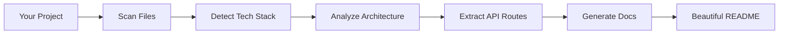

<div align="center">

<br />

# 📚 repo-docgen

### Intelligent Documentation Generator for Your Projects

**Automatically analyze your codebase and generate beautiful, professional documentation in seconds**

<br />

[](https://www.npmjs.com/package/repo-docgen)
[](https://www.npmjs.com/package/repo-docgen)
[](https://github.com/yourusername/repo-docgen/blob/main/LICENSE)
[](https://nodejs.org)

<br />

[Quick Start](#-quick-start) • [Features](#-features) • [Examples](#-examples) • [CLI Options](#-cli-options) • [Contributing](#-contributing)

<br />

</div>

---

## 🎯 What is repo-docgen?

**repo-docgen** is a zero-configuration CLI tool that intelligently scans your project and generates **comprehensive, professional documentation** automatically. No more manual README writing!

### ✨ Perfect For

- 🚀 **New Projects** - Bootstrap documentation instantly
- 📦 **Monorepos** - Handle complex multi-package structures
- 🔄 **Legacy Code** - Document existing projects quickly
- 👥 **Open Source** - Create contributor-friendly docs
- 💼 **Professional Projects** - Maintain consistent documentation

---

## 🌟 Features

<table>
<tr>
<td width="50%">

### 🔍 Smart Detection
- **Automatic tech stack identification**
- React, Vue, Angular, Next.js, Nuxt
- Express, Fastify, NestJS
- MongoDB, PostgreSQL, Redis
- TypeScript, Vite, Webpack

</td>
<td width="50%">

### 📝 Generated Documentation
- **Professional README.md**
- **Project structure visualization**
- **API endpoint documentation**
- **Setup instructions**
- **Tech stack overview**

</td>
</tr>
<tr>
<td width="50%">

### 🏗️ Architecture Analysis
- Frontend-only detection
- Backend-only detection
- Full-stack identification
- Monorepo support
- Workspace detection

</td>
<td width="50%">

### 🎨 Beautiful Output
- Modern markdown formatting
- Emoji-enhanced sections
- Collapsible details
- Tree-based structure
- Method badges for APIs

</td>
</tr>
</table>

---

## 🚀 Quick Start

### Run Instantly (No Installation Required)

```bash
npx repo-docgen
```

That's it! Your documentation will be generated in the `docs/` folder.

### Global Installation

```bash
npm install -g repo-docgen
docgen
```

### Use in Your Project

```bash
cd your-project
npx repo-docgen
```

---

## 📖 Examples

### Basic Usage

```bash
# Generate docs in root directory (default)
npx repo-docgen

# Custom output directory
npx repo-docgen --output=docs

# Overwrite existing docs
npx repo-docgen --overwrite
```

### What Gets Generated

```
your-project/
├── 📄 README.md          # Main project documentation
├── 📄 STRUCTURE.md       # Visual project structure
└── 📄 API.md            # API endpoints (if detected)
```

### Sample Output

**README.md** includes:
- Project overview with badges
- Tech stack breakdown
- Getting started guide
- Project structure
- Available scripts
- Contributing guidelines

**STRUCTURE.md** includes:
- Visual tree structure
- File statistics
- Folder descriptions
- Root file explanations

**API.md** includes:
- Grouped API endpoints
- HTTP method badges
- Request/response examples
- Testing instructions

---

## ⚙️ CLI Options

| Option | Description | Default |
|--------|-------------|---------|
| `--output=<dir>` | Output directory for docs | `.` (root) |
| `--overwrite` | Overwrite existing documentation | `false` |

### Examples

```bash
# Generate in custom folder
npx repo-docgen --output=documentation

# Force regenerate docs
npx repo-docgen --overwrite

# Combine options
npx repo-docgen --output=my-docs --overwrite
```

---

## 🎨 What Makes It Special?

### 🧠 Intelligent Analysis

Unlike other doc generators, **repo-docgen**:
- Recursively scans your entire project
- Detects monorepo structures (npm, yarn, pnpm workspaces)
- Identifies frontend AND backend technologies
- Extracts API routes automatically
- Generates context-aware descriptions

### 🎯 Zero Configuration

No config files, no setup, no hassle:
```bash
npx repo-docgen  # Done! ✨
```

### 📊 Comprehensive Detection

Supports **100+ frameworks and tools**:
- **Frontend**: React, Vue, Angular, Svelte, Next.js, Nuxt, Remix, Astro
- **Backend**: Express, Fastify, Koa, NestJS, Hapi
- **Databases**: MongoDB, PostgreSQL, MySQL, Redis, Prisma
- **Build Tools**: Vite, Webpack, Rollup, Parcel, esbuild
- **Testing**: Jest, Vitest, Cypress, Playwright

---

## 🏗️ How It Works



1. **Scans** your project directory recursively
2. **Analyzes** package.json files and dependencies
3. **Detects** frameworks, libraries, and tools
4. **Classifies** project architecture
5. **Extracts** API routes from code
6. **Generates** professional markdown documentation

---

## 📦 Supported Project Types

| Type | Detection | Example |
|------|-----------|---------|
| Frontend-only | ✅ | React + Vite app |
| Backend-only | ✅ | Express API server |
| Full-stack | ✅ | Next.js with API routes |
| Monorepo | ✅ | Nx, Turborepo, Lerna |
| Vanilla JS | ✅ | Plain HTML/CSS/JS |

---

## 🤝 Contributing

Contributions are welcome! Here's how you can help:

1. 🐛 **Report bugs** - Open an issue
2. 💡 **Suggest features** - Share your ideas
3. 🔧 **Submit PRs** - Improve the code
4. 📖 **Improve docs** - Help others understand

### Development Setup

```bash
# Clone the repository
git clone https://github.com/yourusername/repo-docgen.git

# Install dependencies
cd repo-docgen
npm install

# Run locally
npm start
```

---

## 📄 License

This project is licensed under the **ISC License**.

---

## 👨‍💻 Author

**Rahul Sharma**

---

## 🌟 Show Your Support

If you find **repo-docgen** helpful, please consider:

- ⭐ **Starring the repo** on GitHub
- 📢 **Sharing** with your network
- 🐛 **Reporting issues** you encounter
- 💡 **Suggesting features** you'd like to see

---

## 📚 Related Projects

- [readme-md-generator](https://github.com/kefranabg/readme-md-generator) - Interactive README generator
- [auto-readme](https://github.com/Rishikant181/auto-readme) - Simple README generator
- [documentation.js](https://github.com/documentationjs/documentation) - API documentation generator

---

<div align="center">

### Made with ❤️ by developers, for developers

**[⬆ Back to Top](#-repo-docgen)**

</div>